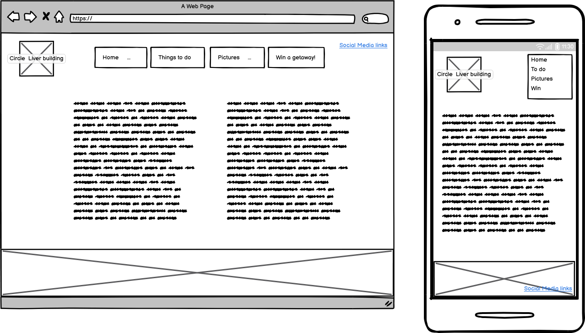
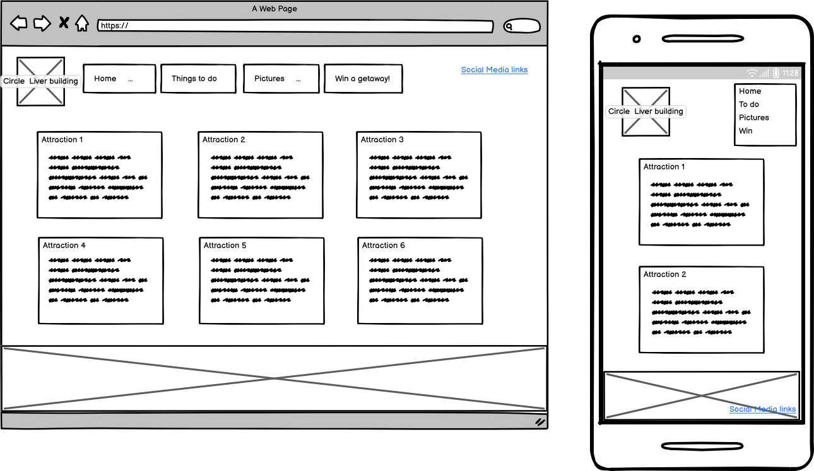
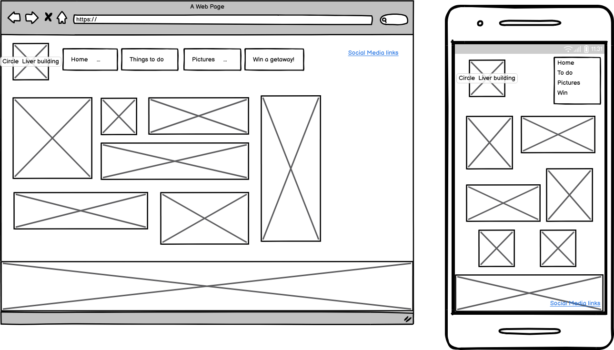
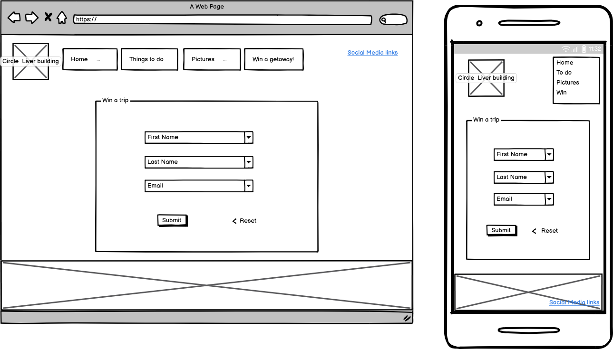

INSERT MOCK UP PICS HERE

Merseymoods is a site designed to help prospective visitors to Merseyside know some of the local attractions available. It comprises of four main sections:
- Home page
- Things to do
- Picture gallery
- Win a trip for 2

Table of Contents

# UX

## Goals

### Visitor goals
The aim for this site is to help visiors decide if they would like to visit Merseyside before making the trip. Therefore, the target audience is:
- People who are undecided about whether they would like to visit the area.
- People who may not have been to Merseyside before.
- People who are keen to see what an area has to offer before making a journey.
- People who would like to win a trip to the area.

### User goals
- Easy to navigate.
- Visuals that give the user an idea of what is available.
- Ability to see additional information on attractions, if they wish.
- An easy way to enter the competition.
- Information about the area.
- Easy access to Social Media links.
- Clear design that is easy to read.

### Meeting the goals
Merseymoods fills the above needs in the following ways:
- Navigation is linked to all pages on the website.
- Navigation buttons have the hover feature, to ensure the user knows where they are clicking before clicking it.
- Navigation buttons have design styling to underline the page that is currently active.
- Pictures of the area have been added to a specific pictures page. 
- Links to additional webpages with attraction information (these pages are not affiliated with me). These pages open in a new tab to make it clear this is a different website.
- The competition form is short and easy to use. An additional page to acknowledge submission was added at a later date, on recommendation of my mentor.
- Information about the area is available on the home page and the Things to do page.
- Social Media links have been added, which open in a new tab.
- Colours have been chosen so that they stand out. More information about this in the colours section of this document.

### Business goals
- Attract visitors to the area, therefor helping local economy.
- Advertising local attractions to help businesses attract more customers.
- Awareness of the local area and it's ammenities.

### User Stories
-- I expect to see local attractions in Merseyside.
-- I am interested in winning a trip.
-- I am not familiar with Merseyside, so I expect to see photographs showing different aspects of the area.
-- I  would like to do some further research, so I expect to see links to attractions where I can find accurate information about prices and opening hours etc.
-- I expect the site to be efficiently laid out and easy to navigate.
-- I expect to be able to read the content without other things such as pictures obstructing the information.
-- I expect the website to be accessible to people who require screen readers.

# Visual Design

## Wireframes

## Fonts

All fonts were sourced from Google Fonts.
- The primary font, which is used for the main body of the content is [Josefin Sans](https://fonts.google.com/specimen/Josefin+Sans). It was chosen because it is a sans-serif font, is clear to read, however has some styling to make it stand out from other sites. I also feel it complements the text chosen for headers.
- The secondary font, which is used for headers and the site logo is [Tilt Neon](https://fonts.google.com/specimen/Tilt+Neon). It was chosen because it a sans-serif font that can be easily read, it also has a fun element to it. As I was going for a nautical theme, some of the letters, especially "o" looked like floatation devices, which I though matched the theme well.

## Icons

[FontAwesome](https://fontawesome.com/) has been used for the Social Media icons, and the icons for the menu items.
The icons have been inserted using the <i> tag, and by using class names to identify styling for these icons. They have been inserted into the header and footer sections of the website, and have been amended based on the media that type used to view the webpage.

## Colours

[Colour template](./assets/images/readme5.png)

As Mersyside is located on the Mersey estuary, I wanted the design to be nautical. I opted for blue for the main background, and a darker shade for the majority of the text. In order to give a large contrast for the menu items, and some of the details, I opted for a colour opposite blue on the colour wheel. For this I chose red. I am also conscious that the two rival football clubs in Liverpool play in Red or Blue, so I opted for the colours not to directly match the football strips. It is intended to give a subtle nod to the two teams, rather than overtly referencing them. My preference is the underdogs of Tranmere Rovers, who play in mainly white. There is some text which is white. 

## Images

## Stytling

This is the Code Institute student template for Codeanywhere. If you are using Gitpod then you need [this template](https://github.com/Code-Institute-Org/gitpod-full-template) instead.  We have preinstalled all of the tools you need to get started. It's perfectly ok to use this templaete as the basis for your project submissions.

You can safely delete this README.md file, or change it for your own project. Please do read it at least once, though! It contains some important information about Codeanywhere and the extensions we use. Some of this information has been updated since the video content was created. The last update to this file was: **August 30th, 2023**

## Codeanywhere Reminders

To run a frontend (HTML, CSS, Javascript only) application in Codeanywhere, in the terminal, type:

`python3 -m http.server`

A button should appear to click: _Open Preview_ or _Open Browser_.

To run a frontend (HTML, CSS, Javascript only) application in Codeanywhere with no-cache, you can use this alias for `python3 -m http.server`.

`http_server`

To run a backend Python file, type `python3 app.py`, if your Python file is named `app.py` of course.

A button should appear to click: _Open Preview_ or _Open Browser_.

In Codeanywhere you have superuser security privileges by default. Therefore you do not need to use the `sudo` (superuser do) command in the bash terminal in any of the lessons.

To log into the Heroku toolbelt CLI:

1. Log in to your Heroku account and go to _Account Settings_ in the menu under your avatar.
2. Scroll down to the _API Key_ and click _Reveal_
3. Copy the key
4. In Codeanywhere, from the terminal, run `heroku_config`
5. Paste in your API key when asked

You can now use the `heroku` CLI program - try running `heroku apps` to confirm it works. This API key is unique and private to you so do not share it. If you accidentally make it public then you can create a new one with _Regenerate API Key_.

---

Happy coding!
