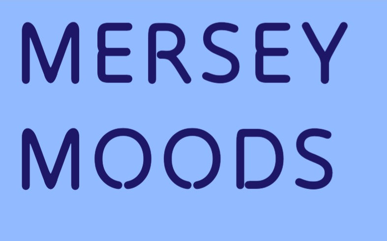
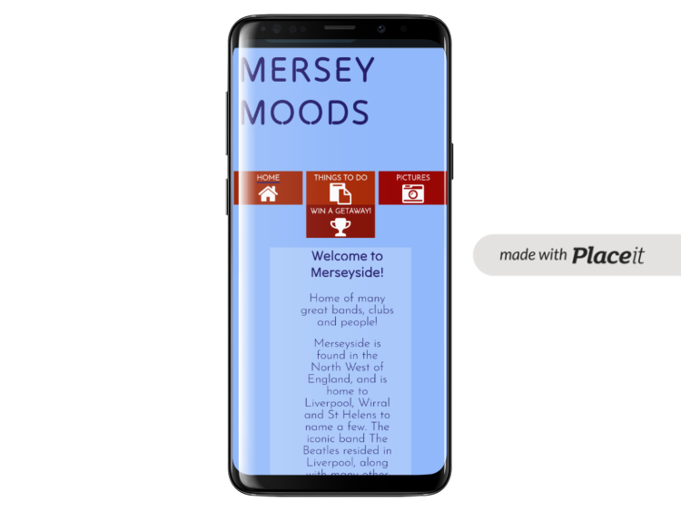
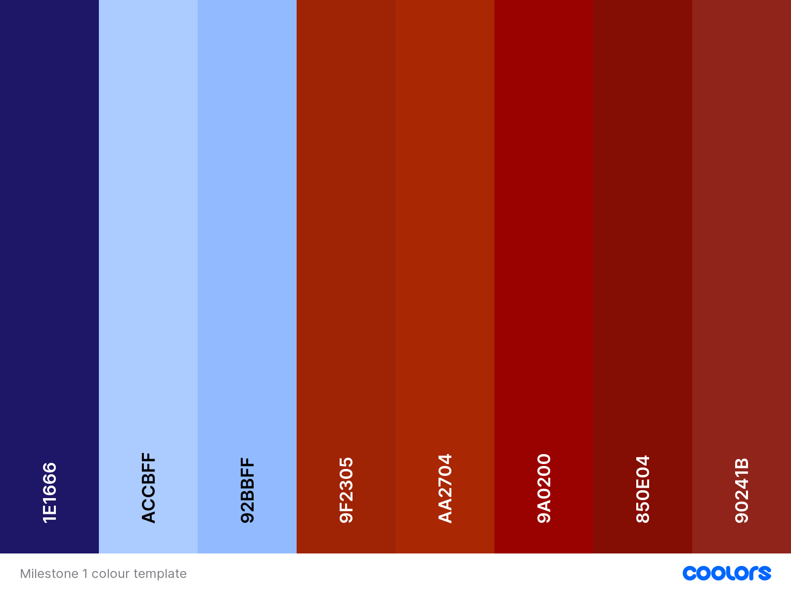

[Merseymoods](https://angielsteele.github.io/visitliverpool3/index.html) is a site designed to help prospective visitors to Merseyside know some of the local attractions available. It comprises of four main sections:

- Home page
- Things to do
- Picture gallery
- Win a trip for 2

----

# Table of Contents

----

# UX

## Goals

### Visitor goals

The aim for this site is to help visiors decide if they would like to visit Merseyside before making the trip. Therefore, the target audience is:

- People who are undecided about whether they would like to visit the area.
- People who may not have been to Merseyside before.
- People who are keen to see what an area has to offer before making a journey.
- People who would like to win a trip to the area.

### User goals

- Easy to navigate.
- Visuals that give the user an idea of what is available.
- Ability to see additional information on attractions, if they wish.
- An easy way to enter the competition.
- Information about the area.
- Easy access to Social Media links.
- Clear design that is easy to read.

### Meeting the goals

Merseymoods fills the above needs in the following ways:

- Navigation is linked to all pages on the website.
- Navigation buttons have the hover feature, to ensure the user knows where they are clicking before clicking it.
- Navigation buttons have design styling to underline the page that is currently active.
- Pictures of the area have been added to a specific pictures page.
- Links to additional webpages with attraction information (these pages are not affiliated with me). These pages open in a new tab to make it clear this is a different website.
- The competition form is short and easy to use. An additional page to acknowledge submission was added at a later date, on recommendation of my mentor.
- Information about the area is available on the home page and the Things to do page.
- Social Media links have been added, which open in a new tab.
- Colours have been chosen so that they stand out. More information about this in the colours section of this document.

### Business goals

- Attract visitors to the area, therefor helping local economy.
- Advertising local attractions to help businesses attract more customers.
- Awareness of the local area and it's ammenities.

### User Stories

1. I expect to see local attractions in Merseyside.
0. I am interested in winning a trip.
0. I am not familiar with Merseyside, so I expect to see photographs showing different aspects of the area.
0. I  would like to do some further research, so I expect to see links to attractions where I can find accurate information about prices and opening hours etc.
0. I expect the site to be efficiently laid out and easy to navigate.
0. I expect to be able to read the content without other things such as pictures obstructing the information.
0. I expect the website to be accessible to people who require screen readers.

----

# Adaptations from original concept

## Colour scheme

- Original colour scheme was intended to capture the rural nature of the location, green and blue
- The blues and greens of the colour scheme were too similar in colour, and did not show a lot of definition for the navigation buttons, so I changed to the scheme that is now being used.

## Design

- The original design was to have a picture of the Liverbirds as a hero logo. Unfortunately, the picture was rectangle and not square, so I was unable to create the original rounded style using the border radius function. I opted to have a logo which was the name of the site, and a picture for the footer instead. The picture of the Liverbirds was then added to the gallery.

----

# Visual Design

## Wireframes

## Fonts

All fonts were sourced from Google Fonts.

- The primary font, which is used for the main body of the content is [Josefin Sans](https://fonts.google.com/specimen/Josefin+Sans). It was chosen because it is a sans-serif font, is clear to read, however has some styling to make it stand out from other sites. I also feel it complements the text chosen for headers.
- The secondary font, which is used for headers and the site logo is [Tilt Neon](https://fonts.google.com/specimen/Tilt+Neon). It was chosen because it a sans-serif font that can be easily read, it also has a fun element to it. As I was going for a nautical theme, some of the letters, especially "o" looked like floatation devices, which I though matched the theme well.

## Icons

[FontAwesome](https://fontawesome.com/) has been used for the Social Media icons, and the icons for the menu items.
The icons have been inserted using the <i> tag, and by using class names to identify styling for these icons. They have been inserted into the header and footer sections of the website, and have been amended based on the media that type used to view the webpage.

## Colours

As Mersyside is located on the Mersey estuary, I wanted the design to be nautical. I opted for blue for the main background, and a darker shade for the majority of the text. In order to give a large contrast for the menu items, and some of the details, I opted for a colour opposite blue on the colour wheel. For this I chose red. I am also conscious that the two rival football clubs in Liverpool play in Red or Blue, so I opted for the colours not to directly match the football strips. It is intended to give a subtle nod to the two teams, rather than overtly referencing them. My preference is the underdogs of Tranmere Rovers, who play in mainly white. There is some text which is white.

## Images

## Stytling

----

# Features

## Page Elements

## Additional features

## Future Ideas

- Links to Social Media linked to specific places, rather than login page.
- Form allowing only one entry per email address, and a pop up message saying this.
- Mobile device having hamburger menu instead of buttons.

----

# Technologies used

## Languages

- [HTML](w3.org/standards/webdesign/htmlcss)
  - Page markup
- [CSS](w3.org/standards/webdesign/htmlcss)
  - Styling

## Frameworks

- [Bootstrap4](https://getbootstrap.com/)
  - Used for some basic styles and layout (e.g. grid for body of the index.html)

## Libaries

- [Google Fonts](https://fonts.google.com/)
  - For styling fonts
- [Fontawesome](https://fontawesome.com/)
  - Used for icons

## Platforms

- [Codeanywhere](https://app.codeanywhere.com/)
  - IDE used to write code
- [Github](https://github.com/)
  - Used to store code remotely and for deployment

## Other Tools

- [Balsamiq](https://balsamiq.com/)
  - To create wireframes
- [PlaceIt](https://placeit.net/)
  - Used for devise mockup images
- [Coolors](https://coolors.co/)
  - Used for creating coloir pallettes

----

# Testing

## Methods

### Validation

### General Testing

- Testing was completed by myself, friends and family members. My mentor also helped me to ensure that I was complying with accessibility frameworks and stadards.
- I updated the social and menu div to nav to conform with html guidelines (as advised by my mentor).
- I used [Page speed](https://pagespeed.web.dev/) to assess accessibility issues. This was advised by my mentor.  Accessibility issues altered as a result of this were the 'Social nav' to include sc-only for identifying the links due to only icons being used. The site also identified that I was not using correct semantic order for some headings.  I wanted to have a smaller heading, but was required to use h2 for correct ordering.  My mentor advised to use a h2 with a class of h3.
- Family identied Social Media links not working, have checked the links and replaced with correct links.
- Friends have identified some spelling errors, which have now been corrected.

### Mobile Testing

- Family identied Social Media links not working, have checked the links and replaced with correct links.
- Family identified that the Social Media links were dark blue on the footer and did not stand out. The media query did not work due to 2 competing queries, altered so that the text is white, and reduced the size for tablet and below.
- Family identified that the pictures were not loading on the picture menu, this was due to Github link differing from CodeAnywhere. Changes so that they now work.

### Desktop Testing

- Family identified that the pictures were not loading on the picture menu, this was due to Github link differing from CodeAnywhere. Changes so that they now work.
- Family identified that the links for Social Media go to their login page. I have left this, as I wanted to demonstrate the links are working, just not to a specific place at the moment.
- Self identified the active page was linked to the incorrect section on the home page, this has been corrected.

## Bugs

### Known Bugs

- Nav bar is not central in the middle of the screen when seen on larger screen sizes

### Fixed bugs

- Logo was on right hand side, I wanted it to the left, used Chrome dev tools to solve the issue by giving the container a margin: 0;
- I wanted my font awesome images to be in the middle of the menus at the top of the page, I used W3schools.com to find the solution to add text-align: center; to my .hometag class
- The menu buttons were originally on separate lines, and there were large gaps between them, I used a combination of Codeinstitute Bootstrap mini-project instructions and chrome dev tools to include .list-inline-item:not(:last-child) {margin-right: 0;} Which solved the issue
- I wanted my navaigation menu to be uniform in size, my mentor suggested setting the padding to 0, and using min-width and max-width. This solved this issue.
- There was a blue line underneath all of the menu items, dev tools helped me to discover that it was an inherited feature from the anchor tag. Created a css rule to take away the text-decoration from the a tag
- In the to do section I wanted to have several of the attractions on the same line when viewing on a tablet and above. I initially tried to use floating, which led to incorrect positioning of some of the text. My mentor suggested using flexbox. I used [Css-tricks](https://css-tricks.com/snippets/css/a-guide-to-flexbox/) to solve this issue, and learn more about flexbox.
- On mobile view the main text for the home page not centred, adjusted the margin-left to 50px to counteract this.
- Logo was ontop of the form in the win section, useing dev tools I found that float:none solved this.

---

# Deployment

## Local Deployment

## Github Deployment

----

# Credit, citations and contact

## Credit

- Original pictures taken by Nicholas Steele on an Android phone
- Information about local area was paraphrased from sites they are linked to in the Things to do section

## Citations

[Mersey Ferry picture](https://www.merseyferries.co.uk/our-cruises/river-explorer-cruise/?gad_source=1&gclid=Cj0KCQjwhfipBhCqARIsAH9msbnVPrRMuwAd625CtTCUIyq1blvIOr2bZ6hhxRb9XX3jhAO5i1V3-QUaAoEnEALw_wcB)

[Crosby Beach picture](https://news.sky.com/story/liverpool-resisters-criticised-for-anti-trans-sticker-stunt-on-crosby-beach-statues-11477713)

[Thor's Rock picture](https://www.liverpoolecho.co.uk/whats-on/reviews/mysterious-wirral-landmark-scenic-walk-24555855)

[Goodison Park picture](https://en.wikipedia.org/wiki/Goodison_Park)

[Anfield picture](https://www.liverpoolfc.com/info/anfield)

[Dream picture](https://www.tripadvisor.co.uk/Attraction_Review-g227131-d1553149-Reviews-Dream-St_Helens_Merseyside_England.html)

[Albert Dock picture](https://www.cultureliverpool.co.uk/tall-ships-albert-dock-dublin/)

[Metropolitan Cathedral picture](https://en.wikipedia.org/wiki/Liverpool_Metropolitan_Cathedral)

## Contact

Please feel free to contact me at angelalsteele@hotmail.com
